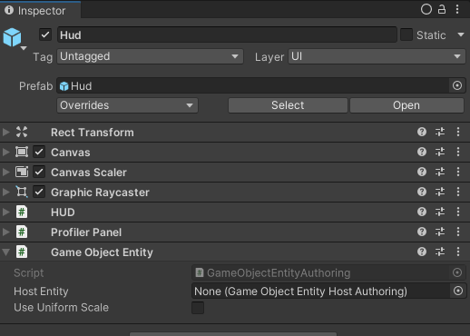
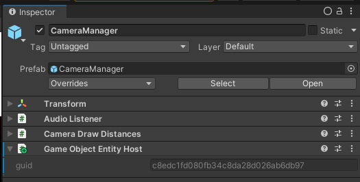
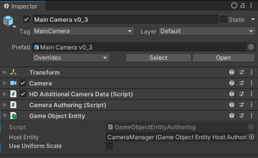

# Getting Started with QVVS Transforms

Whether you are using QVVS Transforms as your main transform system or are using
Unity Transforms and are simply trying to make sense of the TransformQvvs type
in the APIs of other modules, this guide will attempt to provide some intuition
as to what QVVS transforms are and how they work.

## Getting a Feel for QVVS Transforms

QVVS Transforms is the default transform system included with the Latios
Framework. You do not need to set any scripting defines to enable it. However,
it does require installation in the Latios Bootstrap.

### Creating a Scene

Create a new Unity Project and install the Latios Framework. Add a *Latios
Bootstrap* using the *Standard – Injection Workflow*.

Next, add the following code to the bootstrap or a custom script. This code will
preserve hierarchies so that we can play with them.

```csharp
class PreserveHierarchyBaker : Baker<UnityEngine.Transform>
{
    public override void Bake(UnityEngine.Transform authoring)
    {
        GetEntity(TransformUsageFlags.Dynamic);
    }
}
```

Create a new subscene. Add a cube inside it at the origin. Then create a child
sphere. Set the sphere’s Y position to 0.5 and switch over to the game view.
Press play. If you did everything right, you should be able to do this:


Here, we are playing with the `TransformAspect` at runtime. In particular, we
are playing with the `stretch` on the cube. Notice how the sphere moves along
with the top of the cube but does not deform. Play around with the other
`TransformAspect` values. You can switch between local space and world space for
the other three parameters.

## What is a QVVS?

A QVVS is an acronym of its contained quantities – **Q**uaternion, **V**ector,
**V**ector, **S**calar:

-   Quaternion – rotation
-   Vector – position
-   Vector – stretch
-   Scalar – scale

Such a transform is defined by the `TransformQvvs` type in the
`Latios.Transforms` namespace. It can be used to represent both local and
world-space transforms.

There is also a QVS, which drops the *stretch* component. It is defined by the
`TransformQvs` type. As stretch is shared between local and world spaces, this
type is typically used as a local-space companion to a world-space
`TransformQvvs`, avoiding the redundancy in memory. Unity Transforms also uses
QVS as a local-space representation.

Position and rotation are well-understood concepts. Scale is uniform scale and
is equally understood. But as explored in the demonstration above, stretch is
unique. The fundamental rule is that stretch is never influenced by any parent
transform, and it is always the first quantity applied when creating a matrix
representation for rendering or other applications. This means that unlike with
GameObjects where a parent non-uniform scale affects the child’s world space
size, shape, and position, a parent stretch value only affects the child’s
position in world space. The below table shows how the different local-space
quantities affect both the transform’s own world-space equivalent and the
world-space of a child.

|                                        | Self World-Space | Child World-Space     |
|----------------------------------------|------------------|-----------------------|
| Local Position                         | Position         | Position              |
| Local Rotation                         | Rotation         | Rotation, Position    |
| Local Uniform Scale (ECS)              | Size             | Size, Position        |
| Local Non-Uniform Scale (Game Objects) | Size, Shape      | Size, Shape, Position |
| Stretch (QVVS)                         | Size, Shape      | Position              |

It is only when the child’s shape is influenced by the parent that shear can
occur. Therefore, by definition, both QVS and QVVS are shear-free
representations.

For what it is worth, Unity’s RigidTransform is a QV. There is such thing as a
QVV used by other engines. However, the math for that has quirks which are not
worth discussing here.

## The Math of QVVS

QVVS retains many of the mathematical properties shared by QV, QVS, and
matrices. Such properties include associativity and multiplication to convert
between coordinate spaces. For a given local-space QVVS **L**, a parent
world-space QVVS **P**, a world-space QVVS **W** can be computed as follows:

**W** = **PL**

Which can be expressed in code using the static `qvvs` class as follows:

```csharp
var W = qvvs.mul(P, L);
```

Where QVVS catches people off-guard, is unlike QV, QVS, and matrices, it is not
invertible. That is, for a QVVS transform **T**, there is no way to represent
**T**⁻¹ as a QVVS. However, it is possible to define a function that performs
the inverse multiplication operation on **T** to convert a world-space transform
back into local-space.

```csharp
var L = qvvs.inversemulqvvs(P, W);
var L_as_QVS = qvvs.inversemul(P, W);
```

To understand why this is, imagine that a QVVS **T** when applied in a
multiplication operation expands directly into a pair of matrices **U** and
**S** such as:

**T** = **US**

Where the various elements of **T** map directly to the various elements of
**U** and **S**. Now what happens when we try to invert this value:

(**US**) ⁻¹ = **S**⁻¹**U**⁻¹

Notice the order of **S** and **U** flipped! QVVS mapping doesn’t know about
this flipping, and so it maps incorrectly. While it would be possible to add a
flag to QVVS to handle this, for performance reasons, the QVVS module leaves it
up to the user to call the appropriate inverse methods when required, as that’s
usually something the user will know in context.

Because of this, identity also doesn’t always work as one might expect:

```csharp
var isT = qvvs.mul(TransformQvvs.identity, T);
var mightNotBeT = qvvs.mul(T, TransformQvvs.identity); // result stretch will be forced to (1, 1, 1), all other values come from T
var alsoT = qvvs.inversemulqvvs(TransformQvvs.identity, T);
var notIdentity = qvvs.inversemulqvvs(T, T); // all identity values except stretch
```

What definitely does work is associativity.

**W** = **GPL** = (**GP**)**L** = **G**(**PL**)

```csharp
var temp = qvvs.mul(G, P);
var W = qvvs.mul(temp, L);
// Same as
var temp = qvvs.mul(P, L);
var W = qvvs.mul(G, temp);

// And for inverses
var temp = qvvs.inversemulqvvs(G, W);
var L = qvvs.inversemulqvvs(P, temp);
// Same as
var temp = qvvs.mul(G, P); // Yes, not inverse mul
var L = qvvs.inversemulqvvs(temp, W);
```

The `qvvs` class contains many other helpful methods, but feel free to suggest
ones you find to be missing when you need them.

## ECS Components

Now that we’ve covered the math of QVVS transforms, it is time to explore how to
use these in ECS gameplay. By default, the Latios Framework uses a form of QVVS
referred to as *Cached QVVS*. We’ll get to what the “cached” means in a bit, but
first, let’s start with an entity that has no parent nor children. A true
soloist.

An Entity with a transform but without any parent nor children has a single
`IComponentData`, `WorldTransform`. `WorldTransform` contains a single
`TransformQvvs` field. This applies to both static and dynamic entities,
rendered or gameplay-only.

Now let’s suppose that the entity had a child. Similar to Unity Transforms,
Cached QVVS adds and maintains a `DynamicBuffer<Child>` during its group update.
The group is called `TransformSuperSystem`. While you can read this `Child`
buffer, you should never modify it yourself.

Now the actual child entity is where things get interesting. When an entity has
a `Parent` component, it is also given a `PreviousParent` component to detect
parent changes. In addition, it is given a `LocalTransform` and a
`ParentToWorldTransform`. The `LocalTransform` contains a single `TransformQvs`
field. The `ParentToWorldTransform` is where the “cached” comes from, and
contains the parent’s `WorldTransform` from when the `TransformSuperSystem` last
ran. Its purpose is to keep either the world-space or local-space values
approximated as closely as possible (exact if the parent’s world transform
doesn’t change) while the other is preserved exactly. Which values are preserved
exactly and which are approximated depends on the entity’s Hierarchy Update
Mode. By default, all local-space values are preserved exactly, while the
world-space values are approximated.

For this to actually work, you must always modify transform values (except
`Parent`) using `TransformAspect`. `TransformAspect` provides many utility
methods for working with transforms, and it works on both root and child
entities. In the case of root entities, the local and world-space transforms are
identical.

When giving a child a parent via structural change operation (including during
instantiation), you can optionally give the entity a `LocalTransform` with
desired local-space values. This `LocalTransform` will be preserved. Otherwise,
the `TransformSuperSystem` will add the `LocalTransform` with
`TransformQvs.identity`.

However, there is one more type of child, and that’s a child with the
`CopyParentWorldTransformTag`. When this component is added, the entity will not
have a `LocalTransform` nor `ParentToWorldTransform`, and instead copy the
parent’s `WorldTransform` exactly, including the stretch value. The purpose of
this tag is for when an object is broken apart into multiple entities which all
need to share the same transform values, such as a renderer with multiple
material and mesh entities. Attempting to modify the transform of such a child
via `TransformAspect` will result in an error (safety checks only). You are free
to add or remove the `CopyParentWorldTransformTag`, and the
`TransformSuperSystem` will adjust the entity’s archetype accordingly.

### Other Components

`HierarchyUpdateMode` is an optional component that lets you lock world-space
values of a transform. When the `TransformSuperSystem` encounters these locks,
it will modify the local-space values instead. You can add these lock flags to
any entity (not just the ones the baker targets) with the baker extension method
`AddHierarchyModeFlags()`. You can also add/modify/remove the component at
runtime freely.

`PreviousTransform` and `TwoAgoTransform` are optional components as part of the
Motion History feature. `PreviousTransform` contains a copy of the transform
from the start of `SimulationSystemGroup`. While `TwoAgoTransform` contains a
copy of `PreviousTransform` at that same point. These must be added using
special baking request components. See [QVVS Transforms
Baking](QVVS%20Transforms%20Baking.md) for details.

## GameObjectEntity

GameObjectEntity allows you to associate entities with Game Objects in a scene
outside of a subscene. To create one, on a Game Object outside of a subscene
simply add the *Latios -\> Transforms -\> Game Object Entity* component.



If Host Entity is left empty, the Game Object is considered to be
“self-hosting”, and it will copy its `UnityEngine.Transform` to the entity’s
`WorldTransform` every update.

To bind the Game Object to an entity in the subscene, first, add the *Latios -\>
Transforms -\> Game Object Entity Host* component to the subscene Game Object.



Next, drag the subscene Game Object into the *Host Entity* field of the *Game
Object Entity*.



In this mode, at runtime, the GameObjectEntity will create a temporary Entity
that waits for the target host entity to appear. It will then bind the Game
Object to the host entity. The host entity’s `WorldTransform` will be copied to
the Game Object’s `UnityEngine.Transform` every frame.

In both modes, scripts attached to the Game Object can react to the binding to
the self-hosted or externally-hosted entity by implementing the
`IInitializeGameObjectEntity` interface. A common use case is to add
`IManagedStructComponent` components to the entity referencing Game Object
scripts.

Also, at runtime the Entity will have a managed struct component
`GameObjectEntity`, which contains the Game Object’s `UnityEngine.Transform`.
Note that this will exist even for GameObjectEntity instances still searching
for their host.
